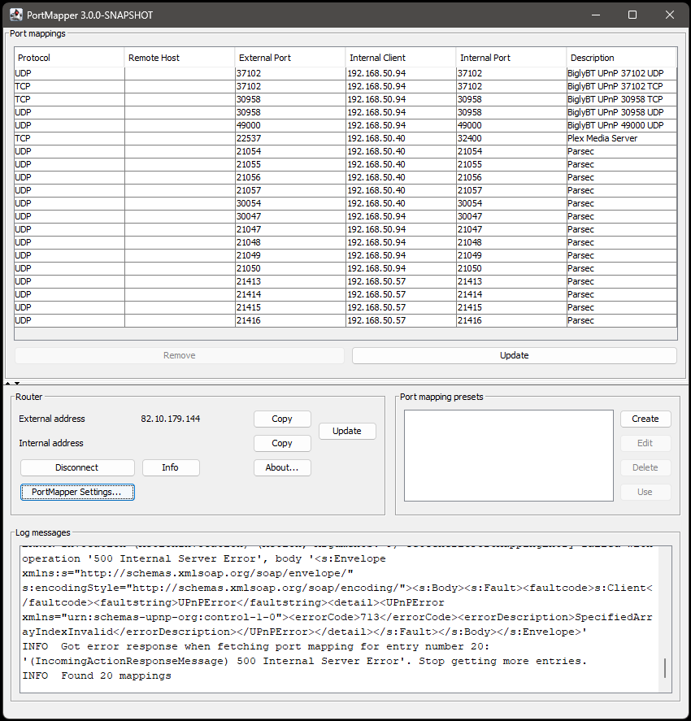

# UPnP PortMapper (The Ant Forge fork)

UPnP PortMapper is a desktop application for managing the port mappings (port forwarding) of a UPnP-enabled router on the local network. View, add, and remove port mappings without touching the router's web interface; preset support makes recurring mappings (game servers, SSH, web servers) a one-click affair.



This repository is **The Ant Forge's private modernization fork** of the original [UPnP PortMapper by Christoph Pirkl](https://github.com/kaklakariada/portmapper), licensed under GPL-3.0. Upstream development was effectively dormant at v2.2.4; this fork modernizes the toolchain and dependencies for current Java. **No work in this repository is submitted upstream**, and **no artifacts are published to Maven Central.**

## What's new in this fork (v3.0.0)

The 3.x line is a wholesale modernization, not a feature release. Everything you could do in upstream 2.2.4 still works; the changes are about making the codebase healthy enough to maintain on modern Java.

**Toolchain & language**

- Java 21 LTS baseline (was Java 8). Records, switch expressions, pattern matching, `java.awt.Desktop`, `java.nio.file.Files.move(ATOMIC_MOVE)` — all in play.
- Gradle 9.5.1, [gradleup/shadow](https://github.com/GradleUp/shadow) for the fat JAR.
- JUnit 5 + Mockito 5 (`MockitoExtension`); was JUnit 4.

**Backends**

- `cling` → [jUPnP 3.0.4](https://github.com/jupnp/jupnp). Cling was abandoned; jUPnP is its actively-maintained fork. Pins Jetty 9.4 at runtime because jUPnP needs `javax.servlet` (not `jakarta`).
- `weupnp` kept as a fallback — some routers respond better to its discovery.
- `sbbi` dropped. The vendored 2008 jar hardcoded acceptance of UPnP version 1.0 and rejected every modern router that advertised 1.1+. Removing it also dropped the `commons-jxpath` chain (xerces, jdom, ant-optional, etc).

**CLI**

- `args4j` (EOL 2018) → [picocli 4.7.7](https://picocli.info/). Flag contract preserved — same `-add`, `-list`, `-externalPort`, etc.

**Swing / UX**

- BSAF (Better Swing Application Framework) removed in seven steps. Plain Swing + small helpers: `Actions` (resource-bundle-driven `AbstractAction` factory), `Messages` (`ResourceBundle` + `${...}` placeholder resolution), `SettingsStorage` (`XMLEncoder`/`XMLDecoder` with atomic write).
- Long-running router calls now run on `SwingWorker` worker threads, not the EDT — UI no longer freezes during discovery, mapping enumeration, or bulk removes.
- Vertical `JSplitPane` between the port-mappings table and the bottom router/preset/log panels — drag the divider to reclaim space when the log grows.
- New filter (default on) suppresses jUPnP's chatty discovery messages about non-router UPnP devices (Sonos, Chromecast, NAS, etc) so the in-app log shows only your router. Toggleable in Settings.
- `SettingsDialog` now opens anchored 50px inside the main window's top-left, not in the screen corner.

**Data model**

- `PortMapping`, `SinglePortMapping`, `PortMappingPreset` are records. `settings.xml` migration shim rewrites obsolete factory FQCNs (the pre-rename Cling FQCN and the dropped SBBI FQCN) to jUPnP on first read.
- `settings.xml` writes are now atomic — a crash mid-write no longer truncates the file and loses your presets.

**Tests**

- 50+ tests across `TestCommandLineArguments` (picocli), `TestDummyRouter` (IRouter contract), `TestSettingsStorage` (atomic roundtrip), `TestMessages` (bundle resolution), `TestActions` (helper).

See [doc/Code-Review-260527.md](doc/Code-Review-260527.md) for the audit that drove the final round of fixes, and [doc/TODO.md](doc/TODO.md) for what's still on the plan.

## Requirements

- **Java 21 LTS** or later. The Adoptium Temurin builds are recommended: <https://adoptium.net/temurin/releases/?package=jre&version=21>

Verify with:

```
java -version
```

## Running

```sh
java -jar portmapper-<version>-all.jar
```

or build and run in one step from a clone:

```sh
./gradlew run
```

## Command-line interface

PortMapper supports a headless CLI mode in addition to the Swing GUI. See available options:

```
java -jar portmapper-<version>-all.jar -h
Usage: portmapper [-description=<description>] [-externalPort=<externalPort>]
                  [-internalPort=<internalPort>] [-ip=<internalIp>]
                  [-lib=<upnpLib>] [-protocol=<protocol>]
                  [-routerIndex=<routerIndex>] [-h | -gui | -add | -delete |
                  -info | -list]
UPnP PortMapper - manage port mappings on a UPnP router
  -h, -help                  Print usage help
      -gui                   Start graphical user interface (default)
      -add                   Add a new port mapping
      -delete                Delete a port mapping
      -info                  Print router info
      -list                  Print existing port mappings
      -ip=<internalIp>       Internal IP of the port mapping (default: localhost)
      -internalPort=<internalPort>
                             Internal port of the port mapping
      -externalPort=<externalPort>
                             External port of the port mapping
      -protocol=<protocol>   Protocol of the port mapping (TCP or UDP)
      -description=<description>
                             Description of the port mapping
      -lib=<upnpLib>         UPnP library to use
      -routerIndex=<routerIndex>
                             Router index if more than one is found (zero-based)
```

### Examples

- Add a port mapping for a specific IP:

  ```sh
  java -jar portmapper-<version>-all.jar -add -externalPort <port> -internalPort <port> -ip <ip-addr> -protocol tcp
  ```

- Add a port mapping for the local machine (omit IP):

  ```sh
  java -jar portmapper-<version>-all.jar -add -externalPort <port> -internalPort <port> -protocol tcp
  ```

- Delete a port mapping:

  ```sh
  java -jar portmapper-<version>-all.jar -delete -externalPort <port> -protocol tcp
  ```

- List existing port mappings:

  ```sh
  java -jar portmapper-<version>-all.jar -list
  ```

- Use a specific UPnP backend library:

  ```sh
  java -jar portmapper-<version>-all.jar -lib org.chris.portmapper.router.weupnp.WeUPnPRouterFactory -list
  ```

### UPnP libraries

PortMapper ships two third-party UPnP libraries. If the default doesn't work for your device, try the other:

- [jUPnP](https://github.com/jupnp/jupnp): `org.chris.portmapper.router.jupnp.JUPnPRouterFactory` (default; active fork of the abandoned Cling library)
- [weupnp](https://github.com/bitletorg/weupnp): `org.chris.portmapper.router.weupnp.WeUPnPRouterFactory`
- `org.chris.portmapper.router.dummy.DummyRouterFactory` (for testing only)

### Language

PortMapper detects your OS language and uses English (`en`), German (`de`), Italian (`it`), or simplified Chinese (`zh`). To override:

```sh
java "-Duser.language=de" -jar portmapper-<version>-all.jar
```

Note the quotes — required when passing `-D` options through PowerShell.

### Custom configuration directory

PortMapper stores GUI settings as XML in a per-user directory. On Windows that's `%AppData%\UnknownApplicationVendor\PortMapper\`. Override with:

```sh
java "-Dportmapper.config.dir=C:/path/to/config" -jar portmapper-<version>-all.jar
```

The directory must exist before launching. CLI mode does not read this directory — all options must be passed as args.

### Manually specifying a router URL

When using the `weupnp` backend, you can bypass UPnP discovery and connect directly to a known router URL:

```sh
java "-Dportmapper.locationUrl=http://192.168.178.1:49000/igddesc.xml" \
     -jar portmapper-<version>-all.jar \
     -lib org.chris.portmapper.router.weupnp.WeUPnPRouterFactory <args>
```

This is useful when a network bridge or unusual topology prevents auto-discovery from working.

## Troubleshooting

### Router not found

- Confirm the router has UPnP enabled.
- Try a different UPnP backend with `-lib`. `DummyRouterFactory` is for testing only.
- Disable any active network bridge on your machine — bridges sometimes break UPnP discovery.
- Set the log level to `TRACE` in the Settings dialog, reconnect, and inspect the log output.

### Adding port mappings fails

- Check that your router allows write access via UPnP (some only permit read).
- Verify port mappings can be added manually via the router's web UI as a sanity check.
- Try a different UPnP backend with `-lib`.

### Multiple routers

If your network has more than one UPnP gateway, use the `weupnp` backend — it prompts you to select one. The `jupnp` backend only supports a single router.

### Expiring port mappings

Some routers garbage-collect port mappings after a period. To work around this, schedule the CLI to re-add the mapping periodically. Windows `.cmd` example:

```cmd
:loop
java -jar portmapper-<version>-all.jar -add -externalPort <port> -internalPort <port> -protocol tcp
timeout 21600
goto loop
```

### "Got error response when fetching port mapping" in the log

This is expected. UPnP doesn't expose the number of available port mappings, so PortMapper enumerates them until the router returns an error — which is the signal that there are no more. The error is informational, not a failure.

## Development

See the [developer guide](doc/developer_guide.md) for build instructions.

## License

GPL-3.0, inherited from the upstream project. See [LICENSE](LICENSE). The original work is copyright (C) 2015 Christoph Pirkl; this fork's modifications are additions under the same license.
